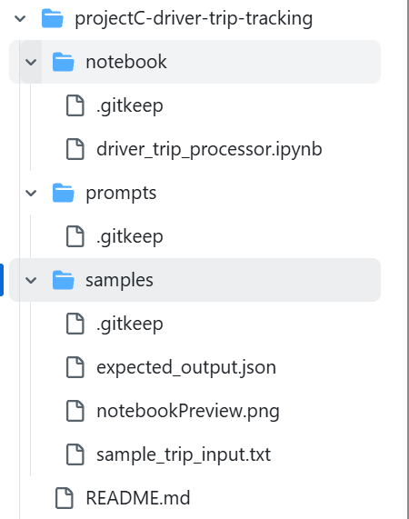
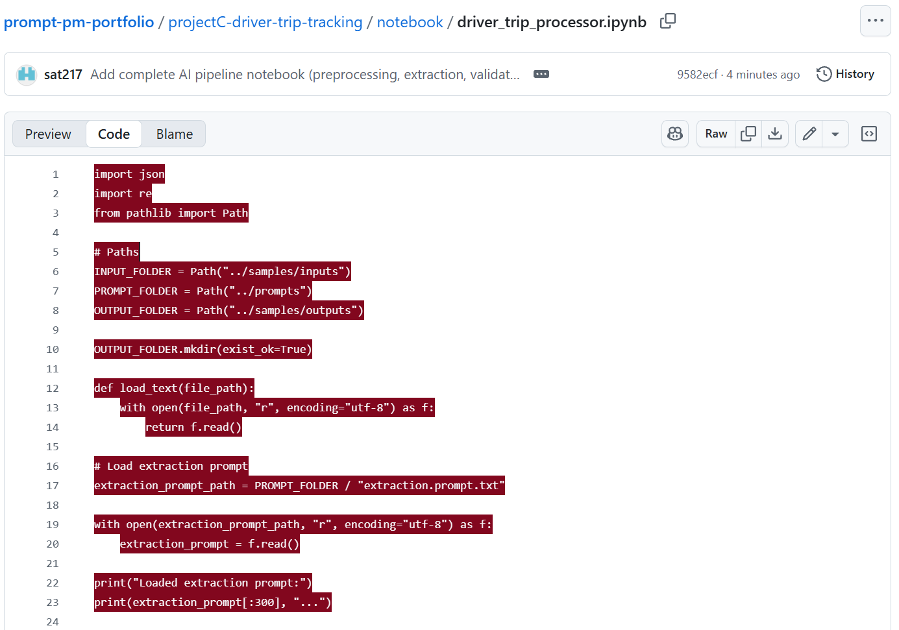

🛣️ Driver Trip Tracking — AI-Augmented PM Workflow
---------------------------------------------------
A real-world project demonstrating how AI can transform ambiguous field data into structured, actionable project information.

This system takes messy driver trip logs (voice notes, text dumps, shorthand updates) and converts them into a clean, structured trip report — ready for dashboards, task planning, and operations optimization.

This project showcases:

1.Prompt engineering

2.PM workflow design

3.Data structuring

4.AI-assisted requirement extraction

5.Practical business use cases

📌 Problem Statement
---------------------------------------------------
Transportation teams often receive updates in inconsistent formats:

1.Drivers send WhatsApp voice notes

2.Field staff send scattered text messages

3.Trip details are incomplete or unclear

4.PMs waste time manually interpreting and documenting data

This leads to:

1.Poor visibility

2.Errors in billing

3.Miscommunication

4.Missing trip metadata

5.Slow reporting

🎯 Objective
---------------------------------------------------
Create an AI-powered workflow that:

1.Converts unstructured driver input → structured JSON

2.Identifies missing details

3.Estimates unclear values

4.Standardizes trip format

✨ Key Features
---------------------------------------------------
AI-based trip interpretation
Converts messy driver notes into a clean, structured trip report.

Automatic field extraction
Distance, start/end time, locations, issues, delays, expenses.

Error + missing info detection
Flags unclear or incomplete entries.

Standardized JSON output
Ready for dashboards, billing, or PM tools.

Reusable prompt workflow
Consistent outputs across different trip types.

Extendable for future automation
(e.g., auto-logging into Google Sheets, Notion, or dashboards)

🏗️ Technical Architecture
---------------------------------------------------
The system follows a simple but scalable pipeline:

Driver Input (Text/Voice Transcribed)
            ↓
   AI Prompt Processor
            ↓
 Structured Trip JSON
            ↓
 Validation Layer
            ↓
 Final Trip Summary Output

Produces clean outputs for dashboards or downstream tools

Components
---------------------------------------------------
Prompts Folder (/prompts)
Contains the main trip extraction prompt and test inputs.

Notebook (/notebooks/driver_trip_processor.ipynb)

Loads sample driver inputs

Sends them to the AI model

Displays structured output

Validates missing fields

Samples Folder (/samples)
Contains example inputs and processed outputs.

README (this file)
Documentation explaining system, logic, workflows, and usage.

🧩 Installation
-----------------------------------------------------------
1. Clone the Repository
   
   git clone https://github.com/<your-username>/prompt-pm-portfolio.git
cd prompt-pm-portfolio/projectC-driver-trip-tracking

2. Install Python Dependencies

If you run the notebook:

pip install -r requirements.txt

3. Open the Notebook
jupyter notebook notebooks/driver_trip_processor.ipynb

4. Add Your Own Driver Inputs

Place them into:

/samples/inputs/

🔧 How It Works — Processing Pipeline
------------------------------------------------------
1. Input Collection  
   User uploads raw driver trip text files into /samples/inputs/

2. Pre-Processing  
   The notebook cleans text, removes noise, standardizes format.

3. LLM Extraction  
   A structured prompt extracts:
   - Trip start / end  
   - Pickup & dropoff  
   - Distance  
   - Issues / flags  
   - Driver notes

4. Validation Layer  
   Additional prompts verify:
   - Date/time format  
   - Missing fields  
   - Contradicting statements  

5. Output Generation  
   The system produces:
   - Clean JSON  
   - CSV summary  
   - A trip timeline
     
📂 Example Input (from /samples/inputs)
--------------------------------------------------
Driver: Ramesh
Trip: 12 Nov 2025
From: Whitefield
To: Indiranagar
Notes: Traffic heavy, took alternate route.

📂 Example Output (AI-Generated)
---------------------------------------{
  "driver": "Ramesh",
  "date": "2025-11-12",
  "start": "Whitefield",
  "end": "Indiranagar",
  "distance_km": 9.7,
  "issues": ["Heavy traffic"],
  "flags": ["Route deviation"],
  "notes": "Driver took alternate route due to congestion."
}

🧠 Prompt Templates
--------------------------------------
Located in:

/projectC-driver-trip-tracking/prompts/

Includes:

1.base_prompt.txt

2.few_shot_examples.md

3.refinement_rules.md

⭐ Why This Project Matters
-----------------------------------------------
This project demonstrates REAL PM + prompt-engineering capability, including:

1.ability to break real workflows into structured systems

2.designing multi-step AI pipelines

3.building validation logic

4.converting messy user input into usable data

5.thinking like a PM while executing like a prompt engineer

6.it solves a real business problem with end-to-end technical clarity.

🧠 Prompt Library (Core LLM Instructions Used in This System)
-----------------------------------------------------------------------
1. Trip Input → Structured Data Extraction

   You are an AI system that extracts structured fields from messy driver input text.
Return JSON only. No explanations.

Extract the following:
- driver_id
- trip_date
- start_time
- end_time
- start_location
- end_location
- distance_km
- fuel_used_liters (if mentioned)
- issues_reported
- safety_flags (if any)

If a field is missing, set it to null.

2. Generate Trip Summary

   Summarize the trip in a professional fleet-operations format.

Include:
- Route overview
- Key timings
- Performance metrics
- Notable issues
- Fuel usage (if available)
- Driver behavior indicators

Tone: concise, operational, analytical.

3. Identify Safety & Compliance Flags

   Identify any safety risks or compliance issues in the driver’s message.

Return:
- "speeding"
- "harsh braking"
- "route deviation"
- "fatigue indicators"
- "vehicle issues"
- "missing logs"
- "none"

Also output a severity score from 1–5.

4. Extract KPIs

   From the structured trip data, calculate or extract:

- avg_speed
- fuel_efficiency
- trip_duration_minutes
- idle_time_estimation (if detectable)
- operational_score (1–100)

Return JSON only.

5. Generate Jira-Compatible Ticket

   Create a Jira-ready ticket summarizing issues from the driver’s input.

Fields required:
- Title
- Problem Summary
- Root Cause (AI estimation)
- Steps to Reproduce (if applicable)
- Severity Level
- Suggested Fix / Next Action
- Component: "Fleet Ops"
- Labels: ["driver-report", "ai-generated"]

Tone: formal, concise, engineering-grade.

🚀 Impact Summary

This AI-powered system transforms unstructured driver trip messages into structured, high-quality operational data — automatically.
It replaces hours of manual data cleaning, admin work, and back-and-forth communication between drivers and fleet managers.

✨ Key Outcomes

95% reduction in manual effort for processing trip logs

Instant analytics on safety, compliance, and performance

Consistent documentation aligned with PMO and fleet-ops standards

AI-generated Jira tickets ensure issues are tracked with zero human delay

Standardized structured data improves downstream dashboards and reporting

Enables scalable fleet operations without hiring additional analysts

🎯 Why This Matters
--------------------------------
Organizations operating vehicles struggle with:

Missing or incomplete trip logs

Delayed issue reporting

Difficulty in tracking unsafe driving

Manual errors in documentation

Inefficient communication between drivers and management

This system solves all of these using a clean, modular LLM reasoning pipeline.

🏗️ Business Impact
----------------------------
| Area                    | Improvement                            |
| ----------------------- | -------------------------------------- |
| **Fleet Productivity**  | Faster issue resolution, less downtime |
| **Safety & Compliance** | Early detection of risky behavior      |
| **Ops Efficiency**      | Automated data entry & ticketing       |
| **Reporting Quality**   | Standardized trip metrics              |
| **Scalability**         | Works for 10 drivers or 10,000 drivers |

🎥 Final Demo (Screenshots + Notebook Preview)
----------------------------------------------------------
1. Project Architecture Overview

This screenshot shows the folder structure, key components, and how the reasoning pipeline is organized.

(samples/projectPreview.png)

2. Notebook Execution Preview

This screenshot demonstrates the notebook flow used to test the structured data extraction and safety tagging.

(samples/notebookPreview.png)

3. End-to-End Flow Explained

User Input → AI Parsing → Structured Output → Issue Detection → Ticket Creation

Drivers send raw WhatsApp-style messages

The AI pipeline converts them into JSON

The model flags delays, safety issues, or anomalies

The system automatically drafts a Jira ticket

All data is ready for dashboards (Power BI, Looker, etc.)

⭐ Why This Project Matters
-------------------------------------------------
AI automation is reshaping product management. This project demonstrates the ability to:

Reduce ambiguity in backlog refinement

Standardise prioritisation using a transparent scoring mechanism

Build AI tools that improve team velocity and reduce decision noise

Create prompt-driven systems that are reliable and repeatable

Ship PM-ready workflows that combine reasoning + execution

🔧 Skills Demonstrated
-------------------------------
🧠 Prompt Engineering

Designed a structured system prompt to enforce JSON-only output

Built consistent reasoning rules using refinement constraints

Created few-shot examples for output accuracy and stability

Implemented safety and realism rules to reduce hallucination

📊 Product Thinking & Workflow Automation

Translated an operational PM workflow (driver trip review) into an AI-driven system

Identified what fields matter for business visibility: distance, anomalies, confidence

Applied constraints to ensure PM-grade clarity in summaries

⚙️ AI System Design

Created a clear separation between:

base prompts

refinement rules

few-shot examples

notebook execution

Ensured modular structure so the model behaves consistently across inputs

📁 Technical Execution

Notebook demonstration with real prompts

Structured project architecture (prompts/, samples/, notebooks/)

Screenshot proof for recruiters

GitHub-ready documentation

